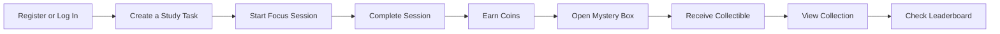
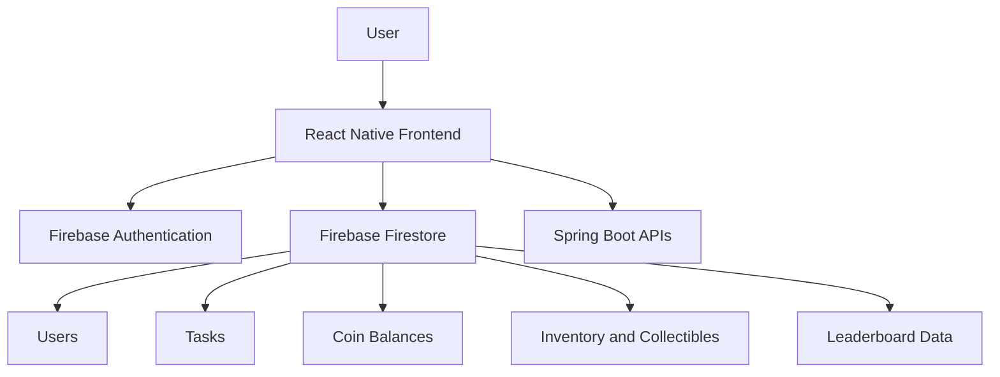

# 🎁 UnboxedU

## STUDY. EARN. UNBOX.

A gamified study application that rewards students with coins and collectible mystery boxes for completing study tasks.

**NUS Orbital 2026 — Milestone 3**  
**Proposed Level of Achievement: Project Gemini**

[🚀 Try UnboxedU](https://unboxedu.web.app)

---

## 📖 About UnboxedU

UnboxedU is a gamified productivity application designed to motivate students to develop consistent study habits through a reward-based system.

Instead of simply completing study tasks, users earn virtual coins that can be spent on mystery boxes containing collectible characters of different rarities.

By combining productivity with gamification, UnboxedU makes studying more engaging and rewarding.

> **Complete Tasks → Earn Coins → Open Boxes → Build Your Collection**

---

## ✨ Features

### 📋 Study Task Manager

- Create, edit, complete and delete study tasks
- Add study durations and due dates
- Separate tasks into Pending and Completed sections
- Synchronise changes with Firebase Firestore in real time

### ⏱️ Focus Session Timer

- Start a focus session based on the selected study duration
- Pause, resume or stop an active timer
- Automatically mark tasks as completed when the timer ends
- Award coins after a successful focus session

### 🍅 Pomodoro Study Mode

- Use structured focus and break intervals
- Pause, resume or stop active Pomodoro sessions
- Break longer study sessions into manageable periods
- Encourage more consistent study habits

### 🪙 Coin Reward System

- Earn virtual coins after completing study sessions
- Receive coins based on the selected study duration
- Store coin balances under individual user accounts
- Preserve balances across different sessions

### 🎁 Mystery Box System

- Spend earned coins to open mystery boxes
- Receive random collectibles through weighted rarity selection
- Deduct coins only after a successful purchase
- Prevent multiple boxes from opening through repeated button presses

### 🖼️ Collection Gallery

- View all collectibles obtained by the user
- Store collectibles permanently in Firestore
- Preserve duplicate collectibles instead of overwriting them
- Display rewards according to each authenticated user’s inventory

### 🏆 Leaderboard

- Compare progress with other users
- Rank users according to the number of mystery boxes opened
- Retrieve and update ranking information through Firestore
- Encourage friendly competition and continued engagement

### 🏅 Achievement Badges

- Reward users for reaching study milestones
- Provide additional progression beyond coins and collectibles
- Encourage users to complete objectives consistently

### 🔐 User Authentication

- Register and log in using Firebase Authentication
- Maintain authenticated user sessions
- Store tasks, coins and collectibles separately for each account

---

## ✅ Milestone 3 Achievements

The following features were completed during Milestone 3:

- Pomodoro study mode
- Leaderboard system
- Achievement badges
- Improved collection gallery
- User interface refinements
- Testing and optimisation
- Deployment of the final application

Milestone 3 transformed UnboxedU from a functional prototype into a more complete gamified productivity application with improved engagement, stability and usability.

---

## 🚶 User Journey

---

## 🏗️ System Architecture

---

## 🛠️ Technology Stack

| Layer | Technology | Purpose |
|---|---|---|
| Frontend | React Native | Application development |
| Styling | NativeWind | User interface styling |
| Backend | Spring Boot | Backend APIs |
| Database | Firebase Firestore | Cloud database and real-time synchronisation |
| Authentication | Firebase Authentication | Secure user registration and login |
| Deployment | Expo | Application deployment and testing |
| Version Control | GitHub | Collaborative source code management |

---

## 🔥 Firebase Integration

Firebase Authentication and Firestore are used to manage user accounts and application data.

The main data stored includes:

- User accounts
- Study tasks
- Task completion status
- Coin balances
- Collectibles
- Duplicate collectible quantities
- Mystery box progress
- Leaderboard information

Each user’s data is stored separately under their authenticated account.

---

## 🔄 Core Workflows

### Authentication Workflow

1. The user registers or logs in.
2. Firebase Authentication verifies the credentials.
3. The user session is maintained.
4. User-specific information is retrieved from Firestore.

### Task and Coin Workflow

1. The user creates a study task.
2. The task is stored in Firestore.
3. The user starts a focus session.
4. The timer counts down based on the selected duration.
5. The completed task is moved to the Completed section.
6. Coins are awarded to the user.
7. The updated coin balance is saved in Firestore.

### Mystery Box Workflow

1. The user selects a mystery box.
2. The required coins are deducted.
3. A weighted probability algorithm selects a rarity.
4. A random collectible is selected.
5. The collectible is stored in Firestore.
6. The collection gallery updates immediately.

### Leaderboard Workflow

1. User progress is retrieved from Firestore.
2. Users are ranked by the number of mystery boxes opened.
3. Updated progress is synchronised with the database.
4. The latest rankings are displayed on the leaderboard.

---

## 📊 Feature Status

| Feature | Status |
|---|---|
| User Authentication | ✅ Completed |
| Study Task Management | ✅ Completed |
| Focus Session Timer | ✅ Completed |
| Coin Reward System | ✅ Completed |
| Mystery Box System | ✅ Completed |
| Collection Gallery | ✅ Completed |
| Firestore Integration | ✅ Completed |
| Pomodoro Study Mode | ✅ Completed |
| Leaderboard | ✅ Completed |
| User Interface Enhancements | ✅ Completed |
| Testing and Optimisation | ✅ Completed |
| Daily Login Rewards | 🟡 To Be Added |
| More Collectibles and Banners | 🟡 To Be Added |

---

## 🧪 Testing and Evaluation

Manual testing was conducted throughout development to ensure that the core features worked correctly under both normal and edge-case scenarios.

### Functional Testing

The following user flows were successfully tested:

- Registering a new account
- Logging in with valid credentials
- Rejecting incorrect login details
- Creating study tasks
- Editing existing tasks
- Deleting tasks
- Starting focus sessions
- Pausing and resuming timers
- Completing focus sessions
- Awarding coins correctly
- Opening mystery boxes
- Preventing purchases with insufficient coins
- Preserving duplicate collectibles
- Retaining user information across sessions
- Logging out and logging back in

### Edge-Case Testing

The application was also tested for:

- Empty task titles
- Very short study durations
- Long study durations
- Editing completed tasks
- Repeated mystery box button presses
- Restarting the application after earning rewards
- Temporary loss of network connection

The completed application supports the full end-to-end journey from task creation to collectible rewards.

---

## ⚠️ Challenges Faced

Several challenges were encountered during development:

- Designing an efficient Firestore database structure
- Synchronising task completion with coin rewards
- Balancing mystery box probabilities and coin costs
- Storing duplicate collectibles without overwriting previous rewards
- Maintaining user-specific information across sessions
- Ensuring real-time updates were reflected correctly

These challenges were addressed through iterative testing and improvements to the application’s data model and business logic.

---

## 🔮 Post-Orbital Enhancements

Possible future improvements include:

- Completing the daily login reward and streak system
- Weekly, monthly and friends-only leaderboards
- Additional collectible characters
- Seasonal limited-edition mystery boxes
- Detailed study analytics
- Collection completion statistics
- Configurable Pomodoro intervals
- Study reminders and notifications
- Post-session reflections
- Expanded friend and social features
- Further performance optimisation

---

## 👥 Team

| Name | Student Number | Programme |
|---|---|---|
| Chua Jinghao | A0324625H | Year 1 Computer Engineering |
| Han Zhong Ding | A0324683Y | Year 1 Computer Engineering |

---

## 🔗 Links

- **Live Application:** https://unboxedu.web.app
- **GitHub Repository:** https://github.com/jinghaochua/UnboxedU

---

## Ready to study, earn and unbox?

[**Launch UnboxedU**](https://unboxedu.web.app)

Made for **NUS Orbital 2026**

